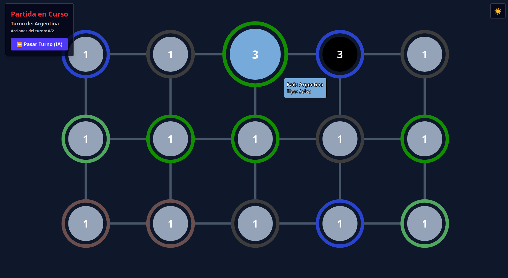

# Circle of Conquest

Proyecto de juego de estrategia por turnos basado en conquista territorial como el juego "Risk". La idea es crear una partida en la que varios países/civilizaciones compiten por controlar un mapa dividido en territorios, con despliegues (refuerzos), ataques, movimiento/reubicación de tropas y turnos automáticos para los bots enemigos.

## Requisitos

- Docker
- Docker Compose
- Dependencias varias (detalladas en los package.json)

## Cómo montarlo

1. Clonar el repositorio
2. Abrir la carpeta raíz del proyecto
3. Ejecutar:

```bash
npm install
docker compose up --build
```

4. Una vez levantados los contenedores, acceder a:
- Frontend: http://localhost:8080
- Backend API: http://localhost:8000
- PostgreSQL: localhost:5432

## Servicios incluidos

- `frontend`: sirve la aplicación web
- `servidor`: API REST del juego
- `bdd`: base de datos PostgreSQL
- `seed`: carga los datos iniciales de países, terrenos y tipos de tropas

## Reiniciar el proyecto

Para levantarlo nuevamente desde cero:

```bash
docker compose down -v
docker compose up --build
```

## ¿Qué es este proyecto?

Es una aplicación web full-stack que combina:
- Frontend estático con HTML, JavaScript y Tailwind CSS
- Backend en Node.js con Express
- Base de datos PostgreSQL
- Lógica de juego para simulación de batallas, turnos y victoria en JavaScript

## Funcionalidades

- Crear una nueva partida desde la interfaz web
- Generar automáticamente un mapa con territorios conectados
- Asignar países/territorios a los jugadores
- Desplegar tropas en territorios propios
- Mover tropas entre territorios aliados
- Atacar territorios enemigos
- Avanzar el turno y permitir que la IA actúe si corresponde
- Consultar el estado completo de la partida desde el backend
- Gestionar (CRUD) países, tipos de tropas y tipos de terreno desde la interfaz de administración

## Capturas de Pantalla

### Tablero de Juego (Mapa de la Partida)


### Editor de Entidades (CRUD)
![Editor de Entidades](./screenshots/Editor.png
